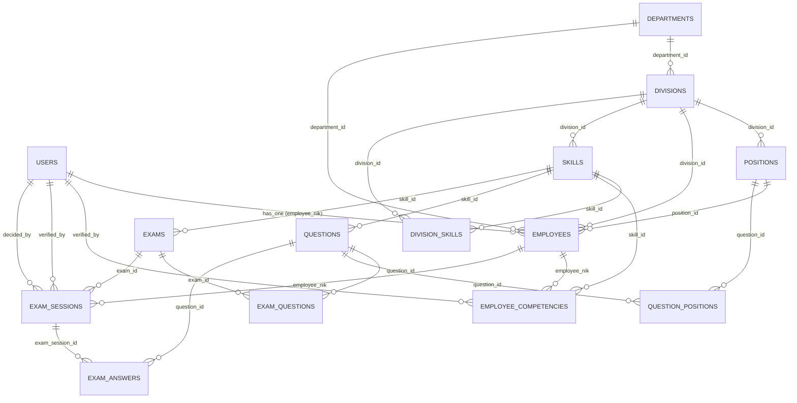

# 📊 DATABASE ERD (Entity Relationship Diagram)
## METINCA Starter App - Complete Schema Documentation

**Last Updated:** May 6, 2026  
**Database:** MySQL 8.0+

---

## 🎯 High-Level Database Architecture

```
┌─────────────────────────────────────────────────────────┐
│              ORGANIZATION STRUCTURE                      │
│  (Department > Division > Position > Employee)          │
└─────────────────────────────────────────────────────────┘
                           ↓
┌─────────────────────────────────────────────────────────┐
│              AUTHENTICATION & USERS                      │
│  (Users with roles: admin, manager, employee)           │
└─────────────────────────────────────────────────────────┘
                           ↓
┌─────────────────────────────────────────────────────────┐
│              COMPETENCY FRAMEWORK                        │
│  (Skills > Employee Competencies > Division Skills)     │
└─────────────────────────────────────────────────────────┘
                           ↓
┌─────────────────────────────────────────────────────────┐
│              CBT EXAM SYSTEM                             │
│  (Questions > Exams > Exam Sessions > Exam Answers)    │
└─────────────────────────────────────────────────────────┘
```

---

## 📋 Complete ERD Diagram



---

## 📑 Detailed Table Documentation

### 1️⃣ ORGANIZATION STRUCTURE TABLES

#### **USERS Table** 👤
**Purpose:** System authentication and user accounts  
**Primary Key:** `id` (auto-increment)

| Column | Type | Nullable | Constraint | Description |
|--------|------|----------|-----------|-------------|
| id | bigint | NO | PK | Auto-increment ID |
| name | varchar(255) | NO | | User full name |
| email | varchar(255) | NO | UNIQUE | Email address |
| nik | varchar(255) | YES | UNIQUE | NIK (employee ID) for dual auth |
| employee_nik | varchar(255) | YES | FK | Link to employees.nik |
| password | varchar(255) | NO | | Hashed password |
| role | varchar(255) | NO | DEFAULT: 'user' | Role: admin, manager, employee |
| profile_photo_url | varchar(255) | YES | | Photo URL |
| email_verified_at | timestamp | YES | | Email verification date |
| remember_token | varchar(100) | YES | | Token for remember-me |
| created_at | timestamp | NO | | Creation timestamp |
| updated_at | timestamp | NO | | Last update timestamp |

**Relationships:**
- `1:N` → `employees` (via employee_nik = employees.nik)
- `1:N` → `employee_competencies` (via id = employee_competencies.verified_by)
- `1:N` → `exam_sessions` (via id = exam_sessions.verified_by)
- `1:N` → `exam_sessions` (via id = exam_sessions.decided_by)

**Notes:**
- Roles: `admin` (full system access), `manager` (approval only), `employee` (limited access)
- One user can optionally link to one employee (not all users are employees)

---

#### **DEPARTMENTS Table** 🏢
**Purpose:** Main organizational departments  
**Primary Key:** `id` (auto-increment)

| Column | Type | Nullable | Constraint | Description |
|--------|------|----------|-----------|-------------|
| id | bigint | NO | PK | Auto-increment ID |
| name | varchar(255) | NO | UNIQUE | Department name (e.g., "Production") |
| description | longtext | YES | | Department description |
| created_at | timestamp | NO | | Creation timestamp |
| updated_at | timestamp | NO | | Last update timestamp |

**Relationships:**
- `1:N` → `divisions` (via id = divisions.department_id)
- `1:N` → `employees` (via id = employees.department_id)

**Hierarchy:** Top-level organization unit

---

#### **DIVISIONS Table** 📍
**Purpose:** Sub-divisions within departments (e.g., Production Lines)  
**Primary Key:** `id` (auto-increment)

| Column | Type | Nullable | Constraint | Description |
|--------|------|----------|-----------|-------------|
| id | bigint | NO | PK | Auto-increment ID |
| department_id | bigint | NO | FK → departments | Parent department |
| name | varchar(255) | NO | | Division name (e.g., "Line A") |
| created_at | timestamp | NO | | Creation timestamp |
| updated_at | timestamp | NO | | Last update timestamp |

**Relationships:**
- `N:1` ← `departments` (via department_id)
- `1:N` → `positions` (via id = positions.division_id)
- `1:N` → `employees` (via id = employees.division_id)
- `1:N` → `skills` (via id = skills.division_id)
- `1:N` → `division_skills` (via id = division_skills.division_id)

**Hierarchy:** Department > **Division**

---

#### **POSITIONS Table** 💼
**Purpose:** Job positions/roles within divisions  
**Primary Key:** `id` (auto-increment)

| Column | Type | Nullable | Constraint | Description |
|--------|------|----------|-----------|-------------|
| id | bigint | NO | PK | Auto-increment ID |
| division_id | bigint | NO | FK → divisions | Parent division |
| name | varchar(255) | NO | | Position name (e.g., "Machine Operator") |
| created_at | timestamp | NO | | Creation timestamp |
| updated_at | timestamp | NO | | Last update timestamp |

**Relationships:**
- `N:1` ← `divisions` (via division_id)
- `1:N` → `employees` (via id = employees.position_id)
- `N:M` ← `questions` (via question_positions pivot)

**Hierarchy:** Department > Division > **Position**

**Notes:**
- Changed from Department > Position to Department > Division > Position (hierarchical structure)
- Can link questions to specific positions (else universal for all positions)

---

#### **EMPLOYEES Table** 👥
**Purpose:** Employee master data  
**Primary Key:** `nik` (varchar, not auto-increment)

| Column | Type | Nullable | Constraint | Description |
|--------|------|----------|-----------|-------------|
| nik | varchar(255) | NO | PK, UNIQUE | Employee NIK (ID) |
| name | varchar(255) | NO | | Employee full name |
| email | varchar(255) | NO | UNIQUE | Employee email |
| department_id | bigint | NO | FK → departments | Department assignment |
| division_id | bigint | NO | FK → divisions | Division assignment |
| position_id | bigint | NO | FK → positions | Position assignment |
| status | enum | NO | DEFAULT: 'Aktif' | Status: Aktif, Non-Aktif |
| join_date | date | YES | | Employee join date |
| photo | varchar(255) | YES | | Employee photo URL |
| created_at | timestamp | NO | | Creation timestamp |
| updated_at | timestamp | NO | | Last update timestamp |

**Relationships:**
- `N:1` ← `departments` (via department_id)
- `N:1` ← `divisions` (via division_id)
- `N:1` ← `positions` (via position_id)
- `1:1` ← `users` (via users.employee_nik)
- `1:N` → `employee_competencies` (via nik = employee_competencies.employee_nik)
- `1:N` → `exam_sessions` (via nik = exam_sessions.employee_nik)

**Hierarchy:** Department > Division > Position > **Employee**

**Notes:**
- Primary key is `nik` (string), not auto-increment
- Foreign keys with `onDelete('restrict')` to prevent accidental deletion
- Email is unique per employee

---

### 2️⃣ SKILLS & COMPETENCY TABLES

#### **SKILLS Table** 🎯
**Purpose:** Competency/Skills definitions (e.g., CMM, PT, MPL, etc.)  
**Primary Key:** `id` (auto-increment)

| Column | Type | Nullable | Constraint | Description |
|--------|------|----------|-----------|-------------|
| id | bigint | NO | PK | Auto-increment ID |
| division_id | bigint | YES | FK → divisions | Associated division (optional) |
| code | varchar(255) | NO | UNIQUE | Skill code (CMM, PT, MPL, RT, UT, US, DIM) |
| name | varchar(255) | NO | | Skill name |
| category | varchar(255) | NO | DEFAULT: 'Technical' | Skill category |
| description | longtext | YES | | Detailed description |
| is_active | boolean | NO | DEFAULT: true | Active status |
| status | enum | NO | | Status: active, inactive |
| created_at | timestamp | NO | | Creation timestamp |
| updated_at | timestamp | NO | | Last update timestamp |

**Relationships:**
- `N:1` ← `divisions` (via division_id)
- `1:N` → `questions` (via id = questions.skill_id)
- `1:N` → `exams` (via id = exams.skill_id)
- `1:N` → `employee_competencies` (via id = employee_competencies.skill_id)
- `N:M` → `divisions` (via division_skills pivot)

**Notes:**
- Skill codes: CMM, PT, MPL, RT, UT, US, DIM (manufacturing related)
- Can be associated with specific division or division-agnostic
- Supports competency levels: 1=Novice, 2=Competent, 3=Proficient, 4=Expert

---

#### **EMPLOYEE_COMPETENCIES Table** 📊
**Purpose:** Track employee skill levels (pivot table)  
**Primary Key:** `id` (auto-increment)

| Column | Type | Nullable | Constraint | Description |
|--------|------|----------|-----------|-------------|
| id | bigint | NO | PK | Auto-increment ID |
| nik | varchar(255) | NO | FK → employees | Employee NIK |
| skill_id | bigint | NO | FK → skills | Skill ID |
| level | integer | NO | DEFAULT: 1 | Competency level (0-4) |
| verified_by | bigint | YES | FK → users | Admin who verified |
| verified_at | timestamp | YES | | Verification timestamp |
| notes | longtext | YES | | Verification notes |
| created_at | timestamp | NO | | Creation timestamp |
| updated_at | timestamp | NO | | Last update timestamp |

**Relationships:**
- `N:1` ← `employees` (via nik)
- `N:1` ← `skills` (via skill_id)
- `N:1` ← `users` (via verified_by) - Admin verification

**Level Scale:**
- `0` = None (not trained)
- `1` = Novice (basic awareness, needs supervision)
- `2` = Competent (can work independently)
- `3` = Proficient (can train others)
- `4` = Expert (subject matter expert)

**Notes:**
- Composite key ensures one employee-skill pair (updated when level changes)
- Tracks who verified and when
- Supports auto-update from exam results

---

#### **DIVISION_SKILLS Table** 🔗
**Purpose:** Map required skills per division (pivot table)  
**Primary Key:** `id` (auto-increment)

| Column | Type | Nullable | Constraint | Description |
|--------|------|----------|-----------|-------------|
| id | bigint | NO | PK | Auto-increment ID |
| division_id | bigint | NO | FK → divisions | Division |
| skill_id | bigint | NO | FK → skills | Required skill |
| required_level | tinyint | NO | DEFAULT: 1 | Minimum required level (1-4) |
| is_mandatory | boolean | NO | DEFAULT: true | Mandatory or optional |
| description | longtext | YES | | Why this skill is needed |
| created_at | timestamp | NO | | Creation timestamp |
| updated_at | timestamp | NO | | Last update timestamp |

**Relationships:**
- `N:1` ← `divisions` (via division_id)
- `N:1` ← `skills` (via skill_id)

**Key Constraint:** `UNIQUE(division_id, skill_id)` - One skill per division

**Notes:**
- Defines which skills are mandatory for each division
- Can track mandatory vs optional skills
- Required level defines minimum competency needed
- Used for compliance & competency matrix reporting

---

### 3️⃣ CBT EXAM SYSTEM TABLES

#### **QUESTIONS Table** ❓
**Purpose:** Bank of exam questions  
**Primary Key:** `id` (auto-increment)

| Column | Type | Nullable | Constraint | Description |
|--------|------|----------|-----------|-------------|
| id | bigint | NO | PK | Auto-increment ID |
| question_set_id | bigint | YES | | Question set grouping |
| set_title | varchar(255) | YES | | Set title (for grouping) |
| skill_id | bigint | NO | FK → skills | Tested skill |
| for_level | tinyint | NO | | Target level (1=Novice, 4=Expert) |
| question_text | longtext | NO | | Question content |
| type | enum | NO | DEFAULT: 'multiple_choice' | Type: multiple_choice, essay, true_false |
| options | json | YES | | MC options {A: "...", B: "..."} |
| correct_answer | varchar(255) | YES | | Correct answer (A/B/C/D or true/false) |
| status | enum | NO | DEFAULT: 'draft' | Status: active, inactive, draft |
| created_at | timestamp | NO | | Creation timestamp |
| updated_at | timestamp | NO | | Last update timestamp |

**Relationships:**
- `N:1` ← `skills` (via skill_id)
- `N:M` → `exams` (via exam_question pivot)
- `1:N` → `exam_answers` (via id = exam_answers.question_id)
- `N:M` → `positions` (via question_positions pivot, optional targeting)

**Question Types:**
- `multiple_choice` - Standard MC (A, B, C, D)
- `true_false` - Boolean questions
- `essay` - Open-ended (manual grading)

**Notes:**
- Questions grouped by `question_set_id` and `set_title`
- Only `active` questions appear in published exams
- Can be targeted to specific positions or universal
- Supports competency level-based questions

---

#### **EXAMS Table** 📝
**Purpose:** Exam/test definitions with settings  
**Primary Key:** `id` (auto-increment)

| Column | Type | Nullable | Constraint | Description |
|--------|------|----------|-----------|-------------|
| id | bigint | NO | PK | Auto-increment ID |
| skill_id | bigint | NO | FK → skills | Tested skill |
| title | varchar(255) | NO | | Exam title (e.g., "CMM Level 2 Upgrade Test") |
| description | longtext | YES | | Exam description |
| target_level | tinyint | NO | | Target competency level (1-4) |
| passing_score | tinyint | NO | DEFAULT: 70 | KKM (Kriteria Ketuntasan Minimal) 0-100 |
| duration_minutes | int | NO | DEFAULT: 60 | Time limit in minutes |
| is_published | boolean | NO | DEFAULT: false | Available to employees |
| status | enum | NO | DEFAULT: 'draft' | Status: draft, active, archived |
| created_at | timestamp | NO | | Creation timestamp |
| updated_at | timestamp | NO | | Last update timestamp |

**Relationships:**
- `N:1` ← `skills` (via skill_id)
- `N:M` → `questions` (via exam_question pivot)
- `1:N` → `exam_sessions` (via id = exam_sessions.exam_id)

**Common Passing Scores (KKM):**
- `70` - Standard passing
- `75` - Higher standard
- `80` - Strict standard
- Configurable per exam

**Notes:**
- Only `published=true AND status=active` exams show to employees
- Multiple versions of same skill can exist (Level 1, 2, 3, 4)
- Duration auto-enforced with browser timer
- Target level is competency level after passing

---

#### **EXAM_QUESTION Table** 🔗
**Purpose:** Maps questions to exams with custom weighting (pivot)  
**Primary Key:** `id` (auto-increment)

| Column | Type | Nullable | Constraint | Description |
|--------|------|----------|-----------|-------------|
| id | bigint | NO | PK | Auto-increment ID |
| exam_id | bigint | NO | FK → exams | Exam ID |
| question_id | bigint | NO | FK → questions | Question ID |
| weight | int | NO | DEFAULT: 20 | Points for this question |
| order | tinyint | NO | DEFAULT: 0 | Display order in exam |
| created_at | timestamp | NO | | Creation timestamp |
| updated_at | timestamp | NO | | Last update timestamp |

**Relationships:**
- `N:1` ← `exams` (via exam_id)
- `N:1` ← `questions` (via question_id)

**Key Constraint:** `UNIQUE(exam_id, question_id)` - One question per exam  
**Index:** `(exam_id, order)` - Fast ordered retrieval

**Scoring Example:**
```
Exam 1 has 5 questions:
Q1: weight=20 points
Q2: weight=20 points
Q3: weight=20 points
Q4: weight=20 points
Q5: weight=20 points
Total: 100 points
Passing: 70% = 70 points
```

**Notes:**
- Weight = points for that question
- Order determines display sequence
- Total weights typically = 100
- Supports custom weighting (some harder Qs worth more)

---

#### **QUESTION_POSITIONS Table** 🔗
**Purpose:** Target questions to specific positions (optional pivot)  
**Primary Key:** `id` (auto-increment)

| Column | Type | Nullable | Constraint | Description |
|--------|------|----------|-----------|-------------|
| id | bigint | NO | PK | Auto-increment ID |
| question_id | bigint | NO | FK → questions | Question ID |
| position_id | bigint | NO | FK → positions | Target position |
| created_at | timestamp | NO | | Creation timestamp |
| updated_at | timestamp | NO | | Last update timestamp |

**Relationships:**
- `N:1` ← `questions` (via question_id)
- `N:1` ← `positions` (via position_id)

**Notes:**
- **Empty = Universal question (for all positions)**
- Use to restrict certain questions to specific job roles
- Example: "Machine Operator" questions only for operators

---

#### **EXAM_SESSIONS Table** 📊
**Purpose:** Individual exam attempt by an employee  
**Primary Key:** `id` (auto-increment)

| Column | Type | Nullable | Constraint | Description |
|--------|------|----------|-----------|-------------|
| id | bigint | NO | PK | Auto-increment ID |
| exam_id | bigint | NO | FK → exams | Exam being taken |
| employee_nik | varchar(255) | NO | FK → employees | Employee taking exam |
| score | smallint | YES | | Final score (0-100) |
| status | enum | NO | DEFAULT: 'assigned' | Workflow status (see below) |
| started_at | timestamp | YES | | When exam started |
| finished_at | timestamp | YES | | When exam completed by employee |
| submitted_at | timestamp | YES | | When submitted for verification |
| verified_at | timestamp | YES | | When admin verified |
| verified_by | bigint | YES | FK → users | Admin who verified |
| admin_notes | longtext | YES | | Verification notes |
| deadline_at | timestamp | YES | | Exam deadline |
| scheduled_start_at | timestamp | YES | | Scheduled start time |
| manager_decision | enum | YES | DEFAULT: 'pending' | Manager approval decision |
| manager_notes | longtext | YES | | Manager approval notes |
| decided_by | bigint | YES | FK → users | Manager who decided |
| decided_at | timestamp | YES | | When manager decided |
| created_at | timestamp | NO | | Creation timestamp |
| updated_at | timestamp | NO | | Last update timestamp |

**Relationships:**
- `N:1` ← `exams` (via exam_id)
- `N:1` ← `employees` (via employee_nik)
- `N:1` ← `users` (via verified_by) - Admin verification
- `N:1` ← `users` (via decided_by) - Manager approval
- `1:N` → `exam_answers` (via id = exam_answers.exam_session_id)

**Status Workflow:**
```
assigned 
  ↓ (employee starts)
started
  ↓ (employee submits)
submitted
  ↓ (admin verifies)
verified_pass (if score >= passing_score)
     ↓
pending_approval
     ↓ (manager decides)
approved / rejected

OR

verified_fail (if score < passing_score)
```

**Status Values:**
- `assigned` - Exam assigned, not started
- `started` - Employee has opened exam
- `submitted` - Employee submitted answers
- `verified_pass` - Admin verified and PASSED
- `verified_fail` - Admin verified and FAILED
- `pending_approval` - Passed, awaiting manager approval
- `approved` - Manager approved result
- `rejected` - Manager rejected result

**Manager Decision Values:**
- `pending` - Waiting for manager decision
- `approved` - Manager approved
- `rejected` - Manager rejected

**Notes:**
- Two-level verification: Admin → Manager
- Optional deadline enforcement
- Tracks all timestamps for audit trail
- Score auto-calculated from exam_answers

---

#### **EXAM_ANSWERS Table** ✅
**Purpose:** Individual question answers within exam session  
**Primary Key:** `id` (auto-increment)

| Column | Type | Nullable | Constraint | Description |
|--------|------|----------|-----------|-------------|
| id | bigint | NO | PK | Auto-increment ID |
| exam_session_id | bigint | NO | FK → exam_sessions | Parent exam session |
| question_id | bigint | NO | FK → questions | Question being answered |
| selected_answer | longtext | YES | | Employee's answer (A/B/C/D or text) |
| is_correct | boolean | NO | DEFAULT: false | Auto-graded for MC |
| score_earned | int | NO | DEFAULT: 0 | Points earned (from exam_question.weight) |
| created_at | timestamp | NO | | Creation timestamp |
| updated_at | timestamp | NO | | Last update timestamp |

**Relationships:**
- `N:1` ← `exam_sessions` (via exam_session_id)
- `N:1` ← `questions` (via question_id)

**Key Constraint:** `UNIQUE(exam_session_id, question_id)` - One answer per question per session

**Notes:**
- Auto-graded for multiple choice/true-false
- Essay answers remain `is_correct=false, score_earned=0` (manual review)
- Score earned = weight from exam_question if correct, else 0
- Final exam score = SUM(all score_earned for session)

---

## 🔄 Key Relationships Summary

### One-to-Many (1:N)
| Parent | Child | Via |
|--------|-------|-----|
| users | employees | employee_nik |
| users | employee_competencies | verified_by |
| users | exam_sessions | verified_by, decided_by |
| departments | divisions | department_id |
| departments | employees | department_id |
| divisions | positions | division_id |
| divisions | employees | division_id |
| divisions | skills | division_id |
| divisions | division_skills | division_id |
| positions | employees | position_id |
| skills | questions | skill_id |
| skills | exams | skill_id |
| skills | employee_competencies | skill_id |
| questions | exam_answers | question_id |
| exams | exam_sessions | exam_id |
| exams | exam_questions | exam_id |
| employees | employee_competencies | employee_nik |
| employees | exam_sessions | employee_nik |
| exam_sessions | exam_answers | exam_session_id |

### Many-to-Many (N:M)
| Table A | Table B | Pivot | Via |
|---------|---------|-------|-----|
| exams | questions | exam_question | exam_id, question_id |
| divisions | skills | division_skills | division_id, skill_id |
| employees | skills | employee_competencies | employee_nik, skill_id |
| questions | positions | question_positions | question_id, position_id |

---

## 📐 Database Indexing Strategy

### Primary Indexes (PK)
```sql
ALTER TABLE users ADD PRIMARY KEY (id);
ALTER TABLE departments ADD PRIMARY KEY (id);
ALTER TABLE divisions ADD PRIMARY KEY (id);
ALTER TABLE positions ADD PRIMARY KEY (id);
ALTER TABLE employees ADD PRIMARY KEY (nik);
ALTER TABLE skills ADD PRIMARY KEY (id);
ALTER TABLE employee_competencies ADD PRIMARY KEY (id);
ALTER TABLE division_skills ADD PRIMARY KEY (id);
ALTER TABLE questions ADD PRIMARY KEY (id);
ALTER TABLE exams ADD PRIMARY KEY (id);
ALTER TABLE exam_question ADD PRIMARY KEY (id);
ALTER TABLE exam_sessions ADD PRIMARY KEY (id);
ALTER TABLE exam_answers ADD PRIMARY KEY (id);
```

### Foreign Key Indexes (FK)
All foreign keys are automatically indexed in MySQL.

### Business Logic Indexes
```sql
-- Exam sessions lookup
CREATE INDEX idx_exam_sessions_employee_nik ON exam_sessions(employee_nik);
CREATE INDEX idx_exam_sessions_status ON exam_sessions(status);
CREATE INDEX idx_exam_sessions_verified_at ON exam_sessions(verified_at);

-- Questions
CREATE INDEX idx_questions_skill_id ON questions(skill_id);
CREATE INDEX idx_questions_for_level ON questions(for_level);
CREATE INDEX idx_questions_status ON questions(status);

-- Exams
CREATE INDEX idx_exams_skill_id ON exams(skill_id);
CREATE INDEX idx_exams_is_published ON exams(is_published);
CREATE INDEX idx_exams_status ON exams(status);

-- Exam questions ordering
CREATE INDEX idx_exam_question_order ON exam_question(exam_id, order);

-- Employee competencies
CREATE INDEX idx_employee_competencies_nik ON employee_competencies(employee_nik);
CREATE INDEX idx_employee_competencies_skill_id ON employee_competencies(skill_id);

-- Division skills
CREATE INDEX idx_division_skills_division_id ON division_skills(division_id);
```

---

## 🔐 Referential Integrity & Cascade Rules

### CASCADE Delete
- `divisions` → `positions` (delete division = delete positions)
- `divisions` → `employees` (restrict - can't delete if has employees)
- `skills` → `questions` (delete skill = delete questions)
- `skills` → `exams` (delete skill = delete exams)
- `exams` → `exam_sessions` (delete exam = delete sessions)
- `exams` → `exam_question` (delete exam = remove Q mappings)
- `exam_sessions` → `exam_answers` (delete session = delete answers)
- `employees` → `employee_competencies` (delete emp = delete competencies)
- `employees` → `exam_sessions` (delete emp = delete sessions)
- `questions` → `exam_answers` (delete Q = delete answers)

### SET NULL
- `exam_sessions.verified_by` (admin deleted = null)
- `exam_sessions.decided_by` (manager deleted = null)
- `employee_competencies.verified_by` (admin deleted = null)
- `employees.division_id` (division deleted = null)
- `skills.division_id` (division deleted = null)
- `users.employee_nik` (employee deleted = null)

### RESTRICT
- `employees` from department (can't delete dept with employees)
- `employees` from division (can't delete div with employees)
- `employees` from position (can't delete position with employees)

---

## 📊 Sample Data Relationships

### Example 1: Employee Skills Progression
```
Employee: Ahmad (NIK: EMP-001)
├── Department: Production
├── Division: Line A
├── Position: Machine Operator
└── Competencies:
    ├── CMM (Competency Modular Machining)
    │   ├── Current Level: 2 (Competent)
    │   └── Exam: CMM Level 2 Upgrade Test
    │       ├── Status: verified_pass
    │       ├── Score: 87%
    │       └── Verified by: Admin
    └── Safety
        ├── Current Level: 1 (Novice)
        └── Exam: Safety Level 1 Training
            ├── Status: assigned
            └── Action: Not started yet
```

### Example 2: Exam Question Setup
```
Exam: CMM Level 2 Upgrade Test
├── Skill: CMM
├── Duration: 60 minutes
├── Passing Score: 70%
├── Status: published
└── Questions:
    ├── Q1 (Level 2) - MC - Weight: 20 - "CMM process description"
    ├── Q2 (Level 2) - MC - Weight: 20 - "Safety procedures"
    ├── Q3 (Level 2) - MC - Weight: 20 - "Maintenance checklist"
    ├── Q4 (Level 2) - MC - Weight: 20 - "Troubleshooting"
    └── Q5 (Level 2) - MC - Weight: 20 - "Quality control"
    Total: 100 points, need 70 to pass
```

### Example 3: Division Skill Requirements
```
Division: Line A
├── Required Skills:
│   ├── CMM: Level 2 (Mandatory)
│   ├── Safety: Level 1 (Mandatory)
│   ├── Maintenance: Level 2 (Mandatory)
│   ├── Quality Control: Level 1 (Optional)
│   └── Advanced Troubleshooting: Level 3 (Optional)
└── Compliance Check:
    ├── Ahmad: ✓ All mandatory skills met
    ├── Bambang: ⚠️ Missing CMM Level 2
    └── Citra: ✗ Below required levels
```

---

## 🗄️ Database Statistics

| Table | Purpose | Est. Rows | Key Columns |
|-------|---------|-----------|------------|
| users | System accounts | ~100 | id, email, role |
| departments | Organization top-level | ~5 | id, name |
| divisions | Sub-departments | ~20 | id, department_id |
| positions | Job roles | ~50 | id, division_id |
| employees | Staff master | ~200 | nik, department_id, division_id |
| skills | Competency definitions | ~10 | id, code |
| questions | Exam question bank | ~500 | id, skill_id, status |
| exams | Test definitions | ~50 | id, skill_id, is_published |
| exam_question | Q-to-exam mapping | ~500 | exam_id, question_id |
| exam_sessions | Exam attempts | ~2000+ | employee_nik, exam_id, status |
| exam_answers | Answer history | ~100000+ | exam_session_id, question_id |
| employee_competencies | Skill tracking | ~2000 | employee_nik, skill_id |
| division_skills | Division requirements | ~100 | division_id, skill_id |

---

## ✅ Constraints & Validations

### Unique Constraints
- `users.email` - Unique email per user
- `users.nik` - Unique NIK per user (optional)
- `departments.name` - Unique department name
- `employees.nik` - Primary key, unique NIK
- `employees.email` - Unique email per employee
- `skills.code` - Unique skill code
- `exam_question.exam_id, question_id` - One Q per exam
- `division_skills.division_id, skill_id` - One skill per division
- `employee_competencies.employee_nik, skill_id` - One competency per emp-skill
- `exam_answers.exam_session_id, question_id` - One answer per question per session

### Enum Constraints
- `users.role` - enum('admin', 'manager', 'employee')
- `employees.status` - enum('Aktif', 'Non-Aktif')
- `questions.type` - enum('multiple_choice', 'essay', 'true_false')
- `questions.status` - enum('active', 'inactive', 'draft')
- `exams.status` - enum('draft', 'active', 'archived')
- `exam_sessions.status` - enum('assigned', 'started', 'submitted', 'verified_pass', 'verified_fail', 'pending_approval', 'approved', 'rejected')
- `exam_sessions.manager_decision` - enum('pending', 'approved', 'rejected')

### Default Values
- `users.role` = 'user'
- `employees.status` = 'Aktif'
- `skills.is_active` = true
- `questions.status` = 'draft'
- `questions.type` = 'multiple_choice'
- `exams.status` = 'draft'
- `exams.is_published` = false
- `exams.passing_score` = 70
- `exams.duration_minutes` = 60
- `exam_question.weight` = 20
- `exam_question.order` = 0
- `exam_sessions.status` = 'assigned'
- `exam_answers.is_correct` = false
- `exam_answers.score_earned` = 0
- `division_skills.required_level` = 1
- `division_skills.is_mandatory` = true

---

## 🔍 Data Flow Examples

### Exam Workflow
```
1. Admin creates Exam (exams table)
2. Admin selects Questions & sets weights (exam_question pivot)
3. Admin publishes exam (is_published=true)
4. Admin assigns exam to Employee (exam_sessions, status=assigned)
5. Employee starts exam (status=started, started_at=now)
6. Employee answers questions (exam_answers table)
7. Employee submits exam (status=submitted, submitted_at=now)
8. System auto-calculates score (SUM exam_answers.score_earned)
9. Admin verifies score (status=verified_pass/fail, verified_at=now, verified_by=user_id)
10. If verified_pass & manager approval required:
    → status=pending_approval
    → Manager reviews (exam_sessions.manager_decision)
    → If approved: status=approved
    → If rejected: status=rejected
11. If verified_pass final: Auto-update employee_competencies level
12. Certificate generated if needed
```

### Competency Tracking
```
Division: Line A requires:
├── CMM Level 2 (mandatory)
├── Safety Level 1 (mandatory)
└── Maintenance Level 2 (optional)

Employee Ahmad competencies:
├── CMM Level 1 → Takes exam → Passes
   └── employee_competencies.level updated to 2
├── Safety Level 0 → Assigned exam → Not started
└── Maintenance Level 0 → No exam assigned yet
```

---

## 🚀 Query Performance Tips

### Fast Lookups
```sql
-- Get employee with all competencies
SELECT e.*, ec.* 
FROM employees e
LEFT JOIN employee_competencies ec ON e.nik = ec.employee_nik
WHERE e.nik = 'EMP-001';

-- Get exam with all questions
SELECT e.*, q.*, eq.weight
FROM exams e
LEFT JOIN exam_question eq ON e.id = eq.exam_id
LEFT JOIN questions q ON eq.question_id = q.id
WHERE e.id = 1
ORDER BY eq.order;

-- Get employee's pending exams
SELECT es.*, e.title, s.name as skill_name
FROM exam_sessions es
JOIN exams e ON es.exam_id = e.id
JOIN skills s ON e.skill_id = s.id
WHERE es.employee_nik = 'EMP-001' AND es.status IN ('assigned', 'started')
ORDER BY es.created_at DESC;

-- Get exam statistics
SELECT 
  e.title,
  COUNT(es.id) as total_attempts,
  SUM(CASE WHEN es.status = 'verified_pass' THEN 1 ELSE 0 END) as passed,
  ROUND(AVG(es.score), 2) as avg_score
FROM exams e
LEFT JOIN exam_sessions es ON e.id = es.exam_id
WHERE es.verified_at IS NOT NULL
GROUP BY e.id;
```

---

## 📝 Notes & Best Practices

1. **Primary Key Strategy**: Mix of auto-increment (most) and natural key (employees.nik)
2. **Foreign Key Relationships**: All properly cascaded or set null for data integrity
3. **Status Tracking**: Comprehensive exam workflow with timestamps for audit
4. **Scaling Considerations**: Indexes on frequently queried columns (status, employee_nik, skill_id)
5. **Audit Trail**: All tables have created_at/updated_at for change tracking
6. **Optional Fields**: Many nullable columns for flexibility without forcing data
7. **Weighting System**: Exam_question.weight allows custom point distribution
8. **Verification Workflow**: Two-level verification (admin + optional manager) for compliance

---

**End of Database Schema Documentation**
