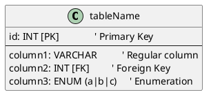
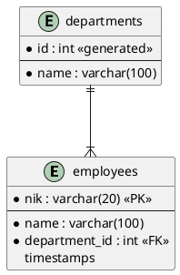

# 📊 PlantUML Database Diagram - METINCA

Dokumentasi lengkap sintaks PlantUML untuk menampilkan database diagram METINCA dalam berbagai format.

---

## **📁 File-File yang Tersedia**

| File | Deskripsi | Best For |
|------|-----------|----------|
| `ERD_PLANTUML_MINIMAL.txt` | Syntax minimal, clean, mudah dibaca | Copy-paste cepat ke online editor |
| `ERD_PLANTUML_COLORED.txt` | Dengan warna per layer | Visual & easy to understand |
| `ERD_PLANTUML_CROWSFOOT.txt` | Crow's foot notation lengkap | Professional documentation |
| `ERD_PLANTUML_SIMPLE.puml` | Versi lengkap untuk VS Code | Editing & preview lokal |
| `DBDIAGRAM_PLANTUML.puml` | Format entity dengan detail | Technical documentation |

---

## **🚀 Quick Start**

### **Opsi 1: Online Editor (Paling Cepat)**

1. Buka: https://www.plantuml.com/plantuml/uml/
2. Copy-paste salah satu syntax dari file `.txt`
3. Klik "Update" atau tekan `Ctrl+Enter`
4. Diagram langsung muncul!

**Recommended file:** `ERD_PLANTUML_MINIMAL.txt`

---

### **Opsi 2: VS Code Editor**

**Langkah 1:** Install Extension
```
Extension: PlantUML (jlangseth.plantuml)
atau
Extension: Plant UML (alireza4.plantuml)
```

**Langkah 2:** Open any `.puml` file:
```
docs/ERD_PLANTUML_SIMPLE.puml
atau
docs/DBDIAGRAM_PLANTUML.puml
```

**Langkah 3:** Preview
```
Tekan: Alt + D (atau Cmd + Option + D untuk Mac)
atau
Klik kanan → "Preview PlantUML Diagram"
```

---

### **Opsi 3: Command Line (Generate PNG/SVG)**

**Install PlantUML:**
```bash
# Windows (dengan Chocolatey)
choco install plantuml

# Mac (dengan Homebrew)
brew install plantuml

# Linux (apt)
sudo apt-get install plantuml
```

**Generate Diagram:**
```bash
# Generate PNG
plantuml -Tpng docs/ERD_PLANTUML_SIMPLE.puml

# Generate SVG
plantuml -Tsvg docs/ERD_PLANTUML_SIMPLE.puml

# Output ke folder tertentu
plantuml -Tpng -o output_folder docs/ERD_PLANTUML_SIMPLE.puml
```

---

## **📐 Syntax Cheat Sheet**

### **Class/Entity Definition**



### **Relationship Notation**

```plantuml
' One to One
Table1 "1" -- "1" Table2

' One to Many
Table1 "1" -- "*" Table2 : relationship_name

' Zero or One to Many
Table1 "0..1" -- "*" Table2

' Many to Many
Table1 "*" -- "*" Table2

' Dotted line (indirect relationship)
Table1 "*" ..> "*" Table2 : triggers
```

### **Crow's Foot Notation** (Entity)



| Simbol | Arti |
|--------|------|
| `*` | Required field |
| `<<PK>>` | Primary Key |
| `<<FK>>` | Foreign Key |
| `<<generated>>` | Auto-generated |
| `\|\|--\|\|` | One to One |
| `\|\|--o\|` | Zero or One |
| `\|\|--{` | One to Many |
| `o\|--{` | Zero or One to Many |

---

## **🎨 Styling Options**

### **Color by Layer**

```plantuml
!define ORG_COLOR #FFE5E5
!define AUTH_COLOR #E5F3FF
!define COMP_COLOR #E5FFE5
!define EXAM_COLOR #FFF5E5

class employees << (T,ORG_COLOR) >> { ... }
class users << (T,AUTH_COLOR) >> { ... }
class skills << (T,COMP_COLOR) >> { ... }
class exams << (T,EXAM_COLOR) >> { ... }
```

### **Theme**

```plantuml
@startuml
!theme plain
' atau
!theme dark
' atau
!theme flatdark
```

### **Skin Parameters**

```plantuml
skinparam backgroundColor #FAFAFA
skinparam linetype ortho          ' Orthogonal lines
skinparam classBorderColor #333
skinparam arrowColor #666
```

---

## **📋 4 Layers dalam METINCA**

```
┌─────────────────────────────────────────┐
│ 1. ORGANIZATION LAYER (Red)             │
│    └─ departments, divisions,           │
│       positions, employees              │
├─────────────────────────────────────────┤
│ 2. AUTHENTICATION LAYER (Blue)          │
│    └─ users, personal_access_tokens     │
├─────────────────────────────────────────┤
│ 3. COMPETENCY LAYER (Green)             │
│    └─ skills, employee_competencies,    │
│       division_skills                   │
├─────────────────────────────────────────┤
│ 4. EXAMINATION LAYER (Orange)           │
│    └─ exams, questions, exam_sessions,  │
│       exam_answers, exam_question       │
└─────────────────────────────────────────┘
```

---

## **🔗 Key Relationships**

### **Data Flow**

```
employees → users (1:1)
departments → divisions → employees (1:N:1)
employees → exam_sessions ← exams (1:N:1)
exam_sessions → exam_answers ← questions (1:N:1)
exam_sessions → employee_competencies (trigger)
```

### **Foreign Keys Count**

- **employees table:** 3 FK (department_id, division_id, position_id)
- **exam_sessions table:** 5 FK (exam_id, employee_nik, verified_by, decided_by)
- **exam_question table:** 2 PK + 2 FK (pivot table)

---

## **💡 Tips & Tricks**

### **1. Nested Comments**
```plantuml
note left of users
  **Dual Authentication**
  - Breeze (session)
  - Sanctum (token)
end note
```

### **2. Class Methods** (untuk use case, bukan table)
```plantuml
class ExamService {
  calculateScore()
  submitExam()
  verifyExamSession()
}
```

### **3. Hide Methods**
```plantuml
skinparam classAttributeIconSize 0  ' Hide icons
hide circle                          ' Hide circle
hide stereotype                      ' Hide <<stereotype>>
```

### **4. Direction Control**
```plantuml
!define DIRECTION top to bottom
' atau left to right
```

---

## **🔄 Export Format**

### **Online Editor Export**
- PNG (download)
- SVG (scalable)
- ASCII art
- Embed code

### **Command Line Export**
```bash
plantuml -Tpng input.puml          ' PNG
plantuml -Tsvg input.puml          ' SVG
plantuml -Ttxt input.puml          ' Text/ASCII
plantuml -Tepdf input.puml         ' PDF (perlu graphviz)
```

---

## **📚 Useful Resources**

- **Official PlantUML Guide:** https://plantuml.com/
- **Online Editor:** https://www.plantuml.com/plantuml/uml/
- **PlantUML Class Diagram:** https://plantuml.com/class-diagram
- **PlantUML Entity Diagram:** https://plantuml.com/entity-relationship-diagram

---

## **✅ Recommended Workflow**

1. **Development:** Edit `.puml` file di VS Code dengan Preview
2. **Documentation:** Export ke PNG/SVG untuk README
3. **Sharing:** Copy-paste ke online editor untuk kolaborasi
4. **Printing:** SVG format untuk kualitas terbaik

---

**Last Updated:** May 12, 2026
**Project:** METINCA Starter App - Training Management System
